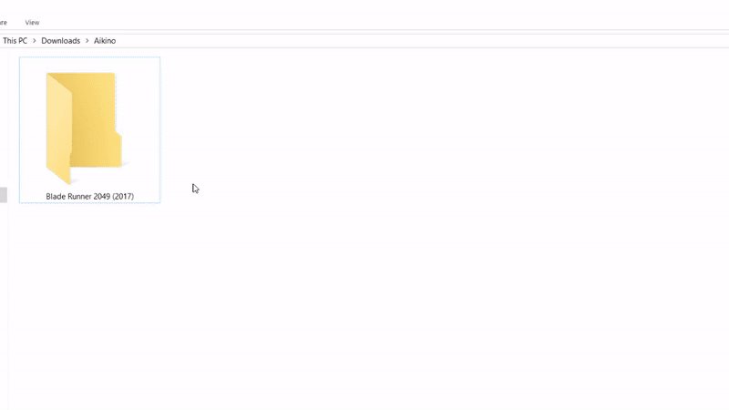

#  Aikino
Aikino is an open source windows application that downloads movie, anime and tv show posters, converts them to icons and applies them


## Features

Features include:
* Browsing posters of Movies, Tv Shows and Anime
* Downloading those posters
* Creating icons from posters and applying created icons
* Icons can be of different types ([With Template](https://www.deviantart.com/musacakir/art/Movie-And-TV-Show-DVD-Folder-Icon-Template-469935243) or Simple)
* 'Open with Aikino' is added to windows *right-click menu* for folders on install.
 * Clicking ''Open with Aikino'' will open Aikino for the selected folder

## FAQ
#### What folders will the app work on?
* For **movie folders** that have the correct year of release in name. 

*For example:*
```
Doctor.Sleep.2019.DC.1080p.BluRay.x265-RARBG
Magnolia (1999)
```
* For **Tv Series folders** that either mention season number or have name followed by a Mini-Series tag.

*For example:*
```
Twin Peaks Season 2
Devs (Mini-Series)
```
* For **anime folders** that either have season number or have an anime, sub, dub or dual-audio tag.

*For example:*
```
Monster (anime)
Legend of Galactic Heroes (Sub)
Tatami Galaxy Season 1
Death Note (Dual-Audio)
```

#### I got the notification that icon was applied. Why isn't the icon displayed on the folder yet?
Windows File Explorer updates on its own pace. It can apply the icon from a few seconds to about 2 minutes. It will update on refresh or when you restart the File Explorer.

#### I changed poster size from settings. Why is the downloaded poster of previous size?
The change takes effect on application restart. So when you restart the application, Aikino will download the poster in the new size. 

#### Why doesn't my movie/tv show/anime have more/any posters?
All posters are provided by [TMDb](https://www.themoviedb.org/). If you have a poster that you want to add and it follows TMDb guidlines, you can upload on TMDb and access it through Aikino.

#### Can I use Aikino to create and apply an icon from a poster that I have?
Currently, you cannot. I might add that in future updates and releases. 

## Credits
Aikino uses the following APIs:
* **imcdonagh** - [image4j](https://github.com/imcdonagh/image4j)
* **Ivan Szkiba**- [ini4j](http://ini4j.sourceforge.net/)
* **divijbindlish** - [parse-torrent-name](https://github.com/divijbindlish/parse-torrent-name)
*  - **holgerbrandl** - [TheMovieDB API](https://github.com/holgerbrandl/themoviedbapi) 

## Disclaimer
**Aikino uses the TMDb API but it is not endorsed or certified by [TMDb](https://www.themoviedb.org/).**
